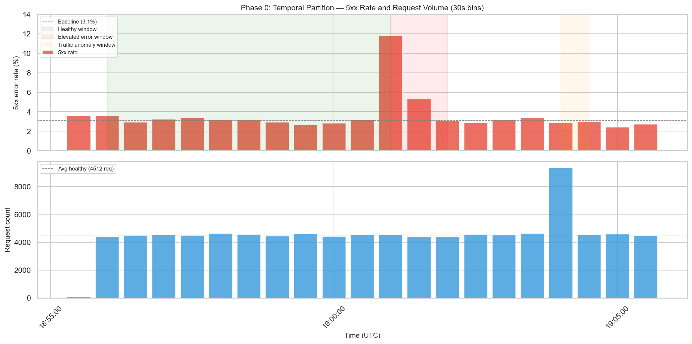
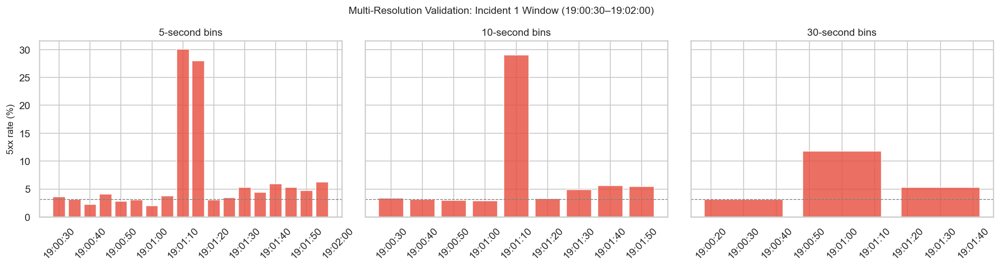
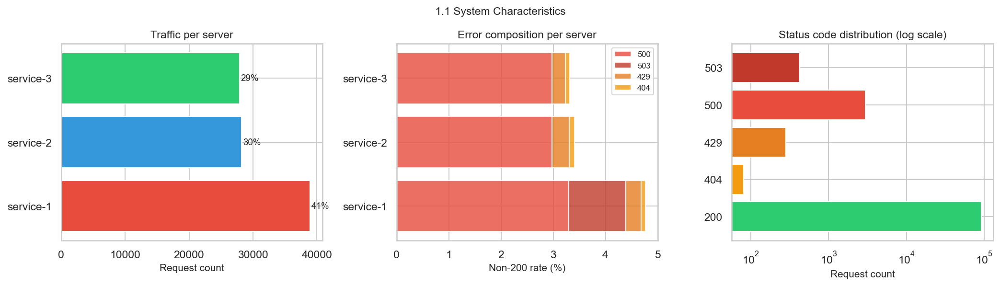
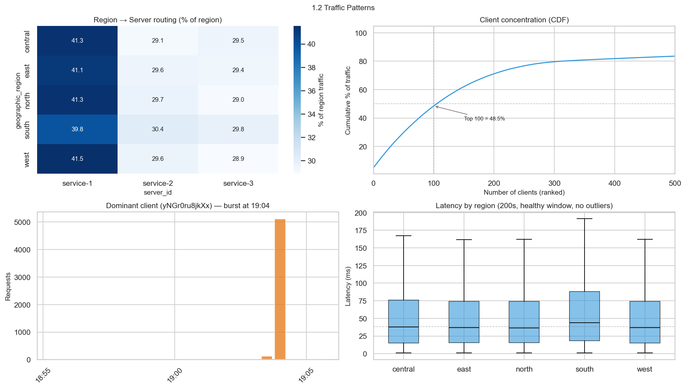
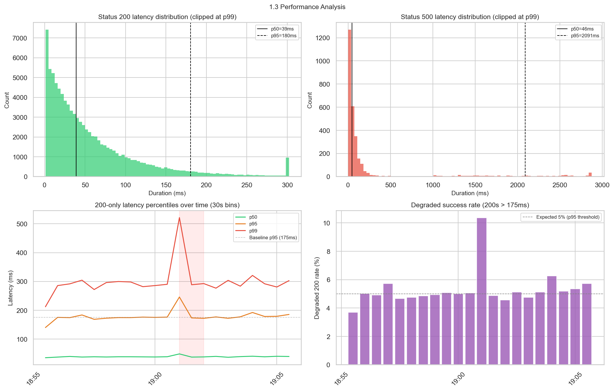
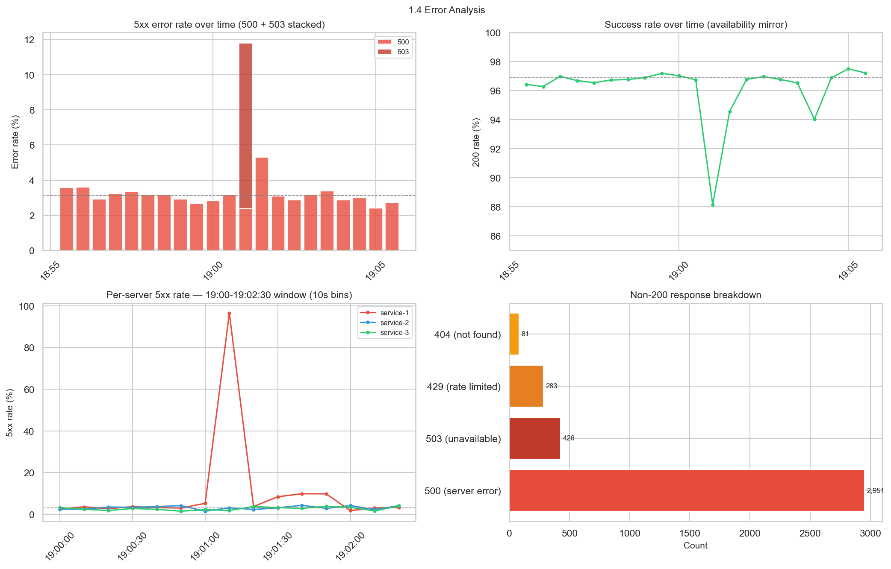
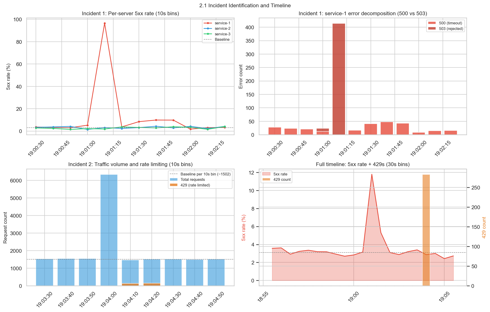
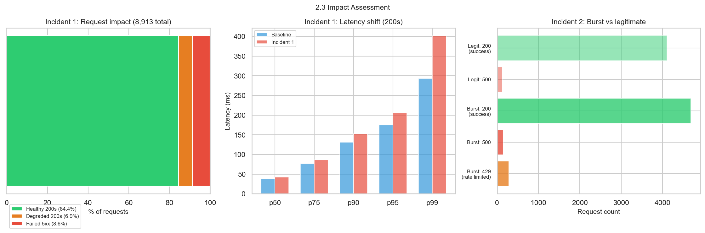
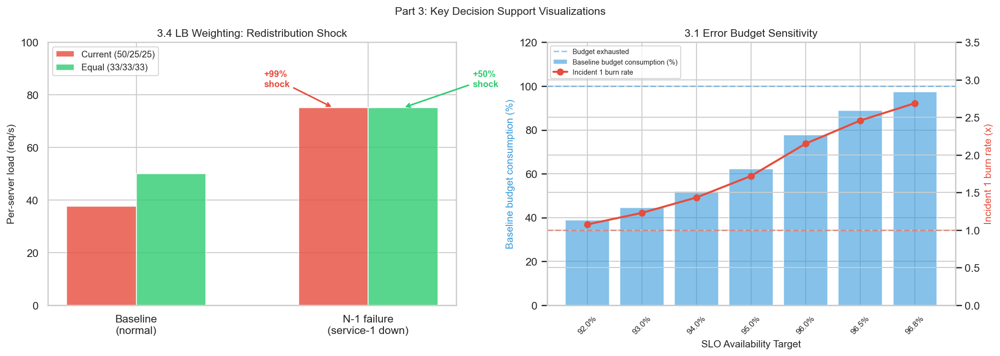

# Telemetry Analysis Report

## Executive Summary

This report analyzes 95,015 HTTP request-response records from a three-server microservice over a 10-minute window (2025-08-12 18:55:59–19:05:59 UTC). The analysis identifies two distinct incidents, characterizes system behavior, and provides data-grounded recommendations.

**System profile:** Three servers behind a weighted round-robin load balancer (50/25/25 split), serving a read-heavy CRUD API (~90% GET) at ~150 req/s. Five endpoint patterns with roughly equal volume. No server-region affinity — all five geographic regions route identically.

**Baseline:** The system maintains a persistent ~3.11% 500 error rate even during healthy operation (stationary, Poisson-distributed). This rate is the dominant factor in error budget consumption — not the observed incidents. Baseline latency: p50=38ms, p95=175ms (200-only).

**Incident 1 (19:01:00–19:02:00) — Service-1 failure.** All 426 503s came from service-1. Onset was binary (<5s), consistent with a health check failure causing LB removal — not gradual overload (no latency precursor detected). Most likely trigger: deployment or container restart (MEDIUM-HIGH confidence). The LB redistributed traffic to service-2/3, which survived without error increase but experienced latency degradation (degraded 200 rate rose from 5% to 7–9% on the surviving servers). Recovery: 503s stopped abruptly; 500 tail persisted ~40s as queued requests timed out. Total impact: 767 failed requests (490 excess over baseline), 1,382 total impacted including degraded 200s.

**Incident 2 (19:04:00–19:04:30) — Client burst.** A single client sent ~5,100 requests in 30 seconds (~500x its normal rate). The rate limiter activated within ~10 seconds, issuing 283 429s. Legitimate user impact: zero — error rate, latency, and degraded success rate all at baseline. Textbook successful rate limiting.

**Key recommendations:**

| # | Recommendation | Priority | Why |
|---|---------------|----------|-----|
| 1 | Health check + LB configuration (graceful draining, multi-failure threshold) | HIGH | Eliminates the 500 recovery tail (281 of 341 incident 500s) |
| 2 | Traffic redistribution safety (N-1 headroom, connection draining) | HIGH | Prevents collateral latency damage on surviving servers |
| 3 | Rate limiter hardening (earlier activation, monitoring) | MEDIUM | Preventive — current system contained the burst |
| 4 | Investigate baseline 5xx rate | HIGH | Baseline 5xx produces ~6x more failures in this window than incident 1's excess |
| 5 | 500 timeout pattern (fast-fail conversion) | MEDIUM | 500s take 2.1s (p95) instead of failing fast |
| LB | Equalize routing to 33/33/33 | HIGH | Halves redistribution shock, eliminates failure concentration |

**SLO framework:** Viable availability target range: 91.4–96.89%. We provide SLI definitions, error budget sensitivity analysis, and 8 business inputs required for final target selection. SLO targets are business decisions — the data bounds the range, stakeholders pick the point.

**Monitoring:** Five detection channels, each traceable to an observed gap. Burn-rate alerting alone does not page for 60-second acute incidents (1.7–2.2x burn at viable targets) — a threshold-based acute channel at 5-second granularity is required as a complement.

---

## Phase 0: Establishing Baseline

Parts 1.3 (performance) and 1.4 (errors) require a definition of "normal," but defining normal requires knowing which data is from healthy operation — which requires incident detection from Part 2. This circular dependency must be resolved before analysis begins.

We break the cycle with a temporal bootstrap: compute the 5xx error rate per 30-second bin across the full 10-minute window, then identify the healthiest contiguous period as a baseline proxy. Automated profiling ([`data_profile_report.html`](supporting/data_profile_report.html)) provided the initial column-level overview; findings were then triaged into signal, noise, and surprising categories, with 11 additional manual investigations beyond the profiler's reach ([`data_profile_triage.md`](supporting/data_profile_triage.md)).

**Selection criteria:** no 503s, no 429s, 5xx rate below 4%, at least 100 requests per bin.

**Result:** The longest qualifying period is **18:56:00–19:01:00 UTC** (300 seconds, 10 bins, 45,070 requests). The full temporal partition:

| Window | Time Range | Duration | Characterization |
|--------|-----------|----------|------------------|
| **Healthy (baseline)** | 18:56:00–19:01:00 | 300s | 5xx avg 3.11%, no 503s/429s, stable ~150 req/s |
| Incident 1 | 19:01:00–19:02:00 | 60s | 5xx spikes to 11.8% (30s), 29% at 10s peak. 503+500. |
| Recovery | 19:02:00–19:04:00 | 120s | Returns to baseline (3.04% avg) |
| Incident 2 | 19:04:00–19:04:30 | 30s | Single-client burst, 283 429s, traffic at 2.07x baseline |
| Post-incident | 19:04:30–19:05:59 | 90s | Returns to baseline (2.72% avg) |

Post-incident windows are also healthy but shorter and potentially influenced by recovery dynamics. The pre-incident window avoids contamination.

**Baseline metrics** (healthy window, 200-only latency):

| Metric | Value | Notes |
|--------|-------|-------|
| Request rate | 150.2 req/s | Stable across bins (147–154 req/s) |
| 200 rate | 96.79% | 43,625 successful requests |
| 5xx rate | 3.11% | Wilson 95% CI: 2.96–3.28%. Stationary (χ² p=0.39). All 500s, zero 503s. |
| p50 latency | 38.2ms | |
| p95 latency | 175.2ms | Used as **degraded success threshold** |
| p99 latency | 293.1ms | |

Per-server latencies are within noise of each other at baseline (p95: 172–177ms across all three servers), confirming no per-instance performance anomaly.

**Degraded success:** A 200 response with latency above the healthy-window p95 (175.2ms) is "functionally degraded" — the request succeeded but user experience was poor. By definition, ~5% of healthy-window 200s exceed this threshold. During incident 1, the degraded rate rises to 7.6% over the full 60-second window (peaking at 10.4% in the worst 30-second bin).

**Multi-resolution validation:** We tested 1s, 5s, 10s, and 30s bin sizes against the incident 1 window.

10-second bins provide the best balance: incident structure visible, noise suppressed, enough temporal detail without false granularity. 30-second bins are used for trend overviews. 5-second bins are used selectively for precise onset timing. 1-second resolution is too noisy for analysis but useful for confirming exact timestamps.

**Caveat:** Even the healthy window has a persistent ~3.1% 500 error rate. This baseline may itself be degraded compared to true steady-state. All baseline-derived thresholds carry this uncertainty.

---

## Part 1: Exploratory Data Analysis

Part 1 builds a picture of the system in four layers: what it is (1.1), how traffic flows through it (1.2), how it performs when healthy (1.3), and where it breaks (1.4). Each layer informs the next, leading into Part 2's incident investigation.

### 1.1 System Characteristics

**Dataset:** 95,015 request-response records spanning exactly 600 seconds (2025-08-12 18:55:59–19:05:59 UTC). Zero missing values, zero duplicates. Each row has a unique `request_id` and `response_id` — no fan-out or request splitting is visible in this data.

**Duration unit:** Microseconds. The case study spec states "request processing time in microseconds." Independently confirmed: the maximum duration is 7,778,093. In milliseconds, that would be 7,778 seconds (2.16 hours) — impossible inside a 10-minute window. In microseconds, it is 7.8 seconds — plausible.

**Service topology:** Three server instances behind what appears to be a weighted round-robin load balancer:

| Server | Requests (full dataset) | Share | Healthy-window share |
|--------|------------------------|-------|---------------------|
| service-1 | ~39,000 | ~41% | **~50%** |
| service-2 | ~28,500 | ~30% | **~25%** |
| service-3 | ~27,500 | ~29% | **~25%** |

The full-dataset split (~41/30/29) is depressed for service-1 because it was pulled from LB rotation during incident 1. The healthy-window split (~50/25/25) reveals the true routing policy: **service-1 handles 2x the traffic of service-2 or service-3.** This is a significant asymmetry with implications explored in Parts 2 and 3.

**Endpoints:** Five URL patterns — `/users`, `/posts`, `/users/{id}`, `/posts/{id}`, `/users/{id}/posts` — each carrying roughly equal volume (~19,000 requests). This is a read-heavy CRUD API.

**Request types:** GET 90.0%, POST 9.0%, PUT 1.0%. Consistent across servers and time periods.

**Status codes:**

| Code | Count | Meaning |
|------|-------|---------|
| 200 | 91,274 | Success (96.1%) |
| 500 | 2,951 | Internal Server Error (3.1%) |
| 503 | 426 | Service Unavailable (0.4%) |
| 429 | 283 | Rate Limited (0.3%) |
| 404 | 81 | Not Found (0.1%) |

The 503s and 429s are concentrated in specific time windows — they are incident signals, not background noise. The 500s are distributed across the full timeline and represent a persistent baseline error rate (see 1.4).

### 1.2 Traffic Patterns

**Request volume is stable at ~150 req/s** throughout the healthy window (147–154 req/s per 30s bin), with no temporal trend or periodicity. The only volume anomaly is the incident 2 burst at 19:04:00, where a single client pushed total request rate to 2.07x baseline. No organic traffic growth or decline is visible in 10 minutes — this is expected given the short window.

**Load balancer routing is geography-agnostic.** Cross-tabulating region by server shows each of the five regions sends traffic in the same ~50/25/25 ratio (±1.7 percentage points). There is no server-region affinity — the LB treats all regions identically. This simplifies impact analysis: no region is preferentially exposed to a specific server's failure.

**Client concentration follows a steep power law.** 1,991 unique clients generated the 95,015 requests:
- Top 1 client: 5,251 requests (5.5% of all traffic)
- Top 10 clients: 10.5% of traffic
- Top 100 clients (5% of client population): 48.5% of traffic
- Median requests per client: 12

The dominant client (`yNGr0ru8jkXx`) is a Chrome/mobile/south client that sends a trickle (1–3 req/bin) for most of the window, then bursts to ~5,100 requests in a single 30-second bin at 19:04:00. This burst is incident 2 (see Part 2).

**GET ratio is stable across all time periods** (88.3–90.7% per 10s bin, per server). The methodology hypothesized that GET ratio shifts during incidents would indicate retry storms (browsers retry GETs but not POSTs). No such shift occurred. If retries happened, they maintained the same request type mix as normal traffic.

**Geographic latency:** The south region has systematically higher latency — p50 of 44.3ms vs ~37ms for other regions, p95 of 203ms vs ~172ms (~19% higher across all percentiles). This is consistent across all time periods and is not incident-related — likely geographic distance or routing.

**Device types and agents:** Three device types (desktop, mobile, other) and six user agents (Chrome, Firefox, Safari, Edge, Opera, app). "app" is the largest single agent at ~20% of requests. Error rates are uniform across both dimensions — agents: 3.22–3.70% (0.48pp range), device types: similarly tight. Failures are server-side, not client- or device-triggered.

### 1.3 Performance Analysis

Latency analysis uses percentiles (not means) because latency distributions are heavy-tailed. All baseline comparisons use 200-only latency from the Phase 0 healthy window.

**Latency varies dramatically by status code:**

| Status | p50 | p95 | p99 | Interpretation |
|--------|-----|-----|-----|----------------|
| 200 | 38.2ms | 175.2ms | 293.1ms | Normal processing |
| 500 | 45.9ms | 2,091ms | 2,876ms | **Timeout behavior** — requests queue, wait, then fail |
| 503 | 42.7ms | 193ms | — | **Fast rejection** — LB returns 503 immediately |

The 500 latency profile is the key finding here. Requests that ultimately return 500 spend 10–15x longer than healthy requests at the tail (p95: 2,091ms vs 175ms). This is not fast-fail — something is timing out. The 503 profile, by contrast, has latency similar to 200s, consistent with the LB rejecting requests before they reach the backend.

**Per-server latency is uniform at baseline:** All three servers show p95 in the 172–177ms range, confirming no per-instance performance anomaly during healthy operation.

**POST/PUT latency is ~2x GET at every percentile** (writes vs reads). Implication: a single latency SLO threshold would disproportionately flag write operations. This is noted for the SLI design in Part 3.1.

**Degraded success over time:** The degraded 200 rate (200s above the 175.2ms p95 threshold) is ~5% during the healthy window by definition. During incident 1, it rises to 7.6% over the full 60-second window (10.4% in the peak 30-second bin). During incident 2, it rises slightly to 6.3%. The degraded success metric captures impact that error rate alone misses — the surviving 200s during incident 1 were measurably slower.

**Response size confirms genuine errors:** 500/503 responses are ~10x smaller than 200s (p50: ~300 bytes vs ~3,050 bytes). These are real error bodies, not mislabeled successes. Response size for 200s does not change during incidents — successful responses return normal payloads even under stress.

### 1.4 Error Analysis

**Error classification framework:** Not all non-200s are equal.

- **5xx (500, 503) — SLO-relevant failures.** These represent genuine service failures. 500 indicates an internal error (typically timeout or resource exhaustion). 503 indicates the service was unavailable (consistent with LB rejection).
- **429 — Rate limiter working correctly.** All 283 429s came from a single client during a burst event. No legitimate users received 429s. Excluded from error budget (rationale in Part 3.1, with caveats stated).
- **404 — Normal application behavior.** 81 total across 52 unique URLs, 91% GETs. Clients requesting resources that don't exist. Scattered and uncorrelated with incidents.

**Baseline 5xx rate is persistent and stable.** During the healthy window, the 5xx rate is 3.11% (Wilson 95% CI: 2.96–3.28%). A chi-square test for homogeneity across 30s bins yields p=0.39 — the bin-to-bin variation (2.70–3.62%) is Poisson noise, not genuine fluctuation. The system has a **stable, persistent ~3.1% 500 error rate even when "healthy."** All healthy-window 5xx are 500s (zero 503s), distributed uniformly across servers and endpoints.

Whether this is acceptable depends on what the service does — 3.1% is alarming for a payment API but may be acceptable for a best-effort content feed. This is the primary SLO calibration challenge (Part 3.1).

**503s are exclusive to service-1 and to incident 1.** All 426 503s came from service-1, concentrated in two 10-second bins: 12 at 19:01:00 (onset) and 414 at 19:01:10 (peak). Zero 503s from service-2 or service-3 at any point in the dataset. This exclusivity strongly suggests an infrastructure-level event on service-1 rather than an application-level bug.

**5xx rate per server** (full dataset vs healthy window):

| Server | Full dataset | Healthy window |
|--------|-------------|---------------|
| service-1 | 4.39% (elevated by incident) | 3.16% |
| service-2 | 2.97% | 3.06% |
| service-3 | 2.97% | 3.06% |

service-1's full-dataset rate is elevated because the incident disproportionately affects it. Healthy-window rates are equal across servers — no per-server baseline issue.

**No endpoint-specific or agent-specific error clustering.** 5xx rates by endpoint range from 3.49% to 3.66% (0.17pp spread). By agent: 3.22% to 3.70% (0.48pp spread). Errors are infrastructure-level, not route-specific or client-triggered.

The temporal error pattern — two distinct spikes with different characteristics — surfaces the incident signatures investigated in Part 2.

---

## Part 2: Incident Detection and Analysis

### 2.1 Incident Identification

**Detection method:** An incident is defined as a sustained period where the 5xx error rate OR p95 latency exceeds 2x the healthy-window baseline for 2+ consecutive 10-second bins. This is a three-step process:

**Step 1 — Pure threshold detection** (5xx > 6.2% or p95 > 350ms): Flags one anomalous 10-second bin at 19:01:10 (29.0% 5xx). Only a single bin exceeds threshold — the acute phase is so brief that it does not produce 2+ consecutive anomalous bins at 10-second resolution. The signal is unambiguous nonetheless; the surrounding timeline (onset, 500 tail, recovery) is characterized by manual inspection below.

**Step 2 — Detection gap analysis:** The 19:04 client burst produced 283 429s and traffic spiked to 4.2x baseline, but the 5xx rate stayed below threshold and latency barely moved. This event is **invisible to 5xx/latency detection** — the rate limiter contained the blast radius so effectively that no downstream metric breached thresholds. A separate 429-rate or traffic-volume channel is needed to catch contained incidents.

**Step 3 — Combined detection** (thresholds + 429 channel): Detects two incidents, each with a different mechanism.

#### Incident 1 — Service-1 Failure (19:01:00–19:02:00)

Per-server timeline at 10-second resolution:

| Time | service-1 | service-2 | service-3 |
|------|-----------|-----------|-----------|
| 19:00:30–19:01:00 | ~3% (baseline) | ~3% (baseline) | ~3% (baseline) |
| 19:01:00–19:01:10 | Elevated (12 503s appear) | ~3% | ~3% |
| **19:01:10–19:01:20** | **96.5% (414 503s)** | **~3%** | **~3%** |
| 19:01:20–19:01:30 | 503s cease, 500s ~8% | ~3% | ~3% |
| 19:01:30–19:02:00 | 500s declining (8→3%) | ~3% | ~3% |
| 19:02:00+ | Baseline restored | Baseline | Baseline |

Key characteristics:
- **Scope:** service-1 only — service-2 and service-3 remained at baseline error rates throughout. The 11.8% aggregate 5xx rate (at 30s resolution) is misleading; service-1's rate was far higher while other servers were unaffected.
- **503 burst:** 426 total, with 414 concentrated in a single 10-second bin. Sub-10-second acute phase.
- **500 tail:** 500 errors remained elevated at ~8% on service-1 for approximately 40 seconds after 503s resolved — a recovery tail, not a separate event.
- **Onset:** Sudden, not gradual. No latency precursor detected (p95 at baseline in the 10 seconds before first 503).
- **Recovery:** 503s stop abruptly. 500s decay gradually over ~40 seconds.

#### Incident 2 — Client Burst / Rate Limiting Event (19:04:00–19:04:30)

| Time | Volume | 429s | 5xx rate |
|------|--------|------|----------|
| 19:03:30–19:04:00 | Baseline (~1,500/10s) | 0 | ~3% |
| **19:04:00–19:04:10** | **~6,300/10s (4.2x)** | 0 | ~3% |
| 19:04:10–19:04:20 | Elevated | 429s appear | ~3% |
| 19:04:20–19:04:30 | Declining | 429s continue | ~3% |
| 19:04:30+ | Baseline | 0 | ~3% |

Key characteristics:
- **Source:** Single client (`yNGr0ru8jkXx`) sent ~5,100 requests in one 30-second bin. Normal rate: ~0.33 req/s. Burst rate: ~170 req/s (~500x increase).
- **Rate limiter response:** 283 429s issued to the burst client starting ~10 seconds after burst onset. No other client received 429s in the entire dataset.
- **System impact:** 5xx rate did NOT spike above baseline. Legitimate user latency and error rates were indistinguishable from the healthy window.

### 2.2 Root Cause Analysis

Root causes are structured as nested hypotheses (mechanism → trigger), not competing alternatives. Each hypothesis is grounded in first principles — what the underlying mechanics predict — rather than authority ("the SRE book says").

#### Incident 1

**Mechanism — Health check failure (HIGH confidence):**

The load balancer detected service-1 as unhealthy and pulled it from rotation. Evidence:

1. **503 is the LB rejection code.** When a target fails health checks, the LB returns 503 for requests routed to it — fast rejection, not queued failure. The 503 latency profile confirms this: p50 of 42.7ms (normal), not the 2,091ms p95 seen for 500s.
2. **Binary onset and offset.** service-1 went from 0% 503 to near-total failure in <5 seconds, then back to 0% 503 equally abruptly. This is consistent with a binary healthy/unhealthy decision, not gradual degradation.
3. **Traffic redistribution confirmed.** During the 503 burst, service-2 volume increased by ~49% and service-3 by ~33% as the LB redirected service-1's traffic. The redistribution was immediate — volume shifted in the same 10-second bin as the first 503s.
4. **service-1 exclusive.** All 426 503s came from service-1. If this were an application-level bug, identical code on service-2/3 would fail identically.

**Trigger — Deployment or container restart (MEDIUM-HIGH confidence):**

Something caused service-1 to fail its health check. The most likely trigger is a container lifecycle event (deployment, restart, or scaling operation). Evidence:

- **Sudden onset rules out overload.** Queuing theory predicts that as utilization approaches 1, wait time grows toward infinity — *gradually*. We would see p95 rising before errors appear. We checked: p95 was at baseline in the 10 seconds before the first 503. No latency precursor.
- **service-1 exclusive is consistent with rolling deployment** — one instance at a time.
- **~10-second duration** matches typical container startup time.
- **Cannot confirm:** No deployment logs, no infrastructure metrics, no health check configuration in the telemetry data. This remains a hypothesis, not a confirmed root cause.

**Overload is unlikely (LOW confidence):**

service-1 handles ~50% of traffic (2x the load of service-2/3), making it the most loaded instance. But higher load alone does not explain sudden onset without a latency precursor. If service-1 were approaching saturation, we would see p99 climbing in the seconds before failure. We do not. A sudden resource limit (connection pool exhaustion, thread pool saturation) could theoretically cause abrupt onset — but that failure mode produces 500s (timeout), not 503s (LB rejection). The 503 signature points to the LB, not the application.

**Collateral mechanism — Traffic redistribution (HIGH confidence):**

When service-1 was removed from rotation, its ~75 req/s was redistributed to service-2/3. The surviving servers handled the extra volume without error rate increase (5xx stayed at baseline ~3%), but latency degraded — degraded 200 rates rose to 8.8% (service-2) and 7.5% (service-3) vs the 5% baseline. The healing mechanism (redistribute traffic) caused collateral latency damage.

**Recovery:**
- 503s stopped abruptly at ~19:01:20 — binary recovery, consistent with health checks passing again.
- 500s on service-1 remained elevated at ~8% for ~40 seconds after — in-flight requests that were queued during the outage timing out as 500s. service-2/3 500 rates stayed at baseline throughout recovery, confirming the tail is service-1 specific.

#### Incident 2

**Root cause — Client-side malfunction (HIGH confidence):**

A single client sent ~170 req/s from a Chrome/mobile/south profile, hitting all endpoints proportionally (not targeting a specific resource). This is consistent with a broken retry loop or runaway automated script — sudden onset, untargeted, from what appears to be an end-user agent.

**System response — Rate limiter worked correctly.** 429s appeared within 10–20 seconds of burst onset. Legitimate users were completely unaffected: error rate at 2.93% (below the 3.11% baseline), latency at baseline, degraded 200 rate at 5.15% (vs 5% baseline). This is a textbook successful rate limiting response.

**Negative finding — No retry storm evidence.** The GET ratio remained flat at ~90% during both incidents, across all servers. The methodology hypothesized that GET ratio shifts would indicate retry storms (browsers retry GETs but not POSTs). No such shift occurred. This does not prove retries didn't happen — only that they weren't method-biased.

**Known unknowns** (what additional telemetry would resolve):

| Gap | What it would resolve |
|-----|----------------------|
| Deployment logs | Confirm/deny deployment as incident 1 trigger |
| Health check config | Confirm failure threshold timing and interval |
| Infrastructure metrics (CPU, memory, connections) | Definitively rule out overload |
| Distributed tracing | Map dependency chain, confirm no upstream trigger |
| Client session data | Confirm retry loop mechanism for incident 2 |
| Rate limiter config | Understand threshold, scope (per-client vs per-IP) |

### 2.3 Impact Assessment

Impact is measured across three dimensions: request volume, user experience, and differential impact.

#### Incident 1

**Request volume:**
- Total requests in incident window (19:01:00–19:02:00): 8,913
- Failed (5xx): 767 (503: 426, 500: 341) — 8.6% of requests
- Degraded success (200s above 175.2ms threshold): 615 (7.6% of 200s vs ~5% baseline)
- Total impacted: 1,382 requests (5xx + degraded)
- Expected at baseline rate (3.11%): 277 5xx. Excess failures: 490.

**User experience:**
- Error rate trajectory (30s bins): 3.2% → 11.8% → 5.3% → 3.1%
- Latency shift (200s only): p50=42.4ms (+11%), p95=206ms (+18%), p99=402ms (+37%) vs baseline — the surviving successful requests took longer.
- Time-to-recovery: ~60 seconds total. 503s resolved in <10 seconds; the 500 tail took ~50 seconds.

**Differential impact:**
- **By server:** service-1 bore the direct error impact (96.5% 5xx at 10s peak, 21.4% over the full 60s window). service-2/3 experienced latency degradation only, not error rate increase.
- **By region:** Uniform impact across all five regions (range <3 percentage points). Confirmed by the absence of server-region affinity — no region was preferentially exposed to service-1.
- **By device type and agent:** Uniform. No client segment experienced systematically worse outcomes.

#### Incident 2

**Request volume:**
- Total requests in window (19:04:00–19:04:30): ~9,300 (~2x baseline)
- Burst client: ~5,100 requests (55% of window volume)
- Legitimate users: ~4,200 requests
- 429s: 283 (all burst client)
- Burst client 500 rate: ~2.8%. Legitimate user 500 rate: ~2.9% (below baseline 3.11%).

**User experience (legitimate users only):**
- Latency: p50=37.4ms, p95=177.3ms — identical to baseline.
- Degraded 200 rate: 5.15% — at baseline.
- **Verdict: No measurable impact on legitimate users.**

**Differential impact:** Entirely concentrated on the burst client. The rate limiter effectively isolated the blast radius.

**Limitation:** We see requests, not users. The 767 failed requests in incident 1 could be 767 users each failing once, or a smaller number retrying. Without session correlation, we cannot distinguish these. However, the absence of GET ratio shift suggests retry amplification was minimal.

---

## Part 3: System Design and Monitoring Recommendations

Every recommendation in Part 3 traces back to something observed in Parts 1–2. No generic best-practice lists — the value is in the traceability chain: observed X → caused by Y → recommend Z.

Note: The case study lists Monitoring before SLOs. We reorder because burn-rate alerting (3.2) requires error budgets, which require SLO targets (3.1). SLOs define what "good" looks like; monitoring detects deviations from that definition.

### 3.1 Service Level Objectives (SLOs)

SLOs are contracts between a service and its stakeholders about what "good enough" means. That is a business decision informed by data — not a data decision. With 10 minutes of telemetry and zero business context, we cannot prescribe targets. What we can do: define SLIs, characterize the baseline, bound the viable target range, show how error budgets behave across that range, and state what's missing.

#### SLI Definitions

**SLI-1 (Availability):** Non-5xx requests / total requests. Only 5xx counts as failure.

Status code classification:
- **404 — Exclude.** Normal application behavior (clients requesting nonexistent resources). Straightforward technical decision.
- **429 — Design choice, not a fact.** We recommend excluding, with caveats. In this dataset, 429s were concentrated on a single burst client during incident 2 — no legitimate users received 429s. However, the data does not show whether the rate limiter threshold is correctly configured, whether legitimate users receive 429s under other conditions, or what the caller experiences. If the rate limiter is misconfigured, excluding 429s silently hides real user failures. This decision should be validated against the rate limiter's configuration and client contracts.

**SLI-2 (Latency):** Successful requests within threshold / total successful requests. Threshold defined relative to baseline percentiles.

Important caveat: In the incidents observed, the latency SLI barely moved. The gap between healthy and incident 1 is only 1–3 percentage points across all candidate thresholds. Incident 1's primary signal was error rate, not latency degradation of surviving 200s. For this system's observed failure modes, availability is the primary detection channel. Latency SLI catches brownouts (slow degradation), not blackouts (hard failure).

**SLI-3 (Quality):** Composite — a request is "good" only if non-5xx AND within the latency threshold. Single metric for dashboards and error budget tracking.

#### Baseline Characterization

| Metric | Value |
|--------|-------|
| Availability (non-5xx) | 96.89% |
| 5xx rate | 3.11% (stationary, χ² p=0.39) |
| Request rate | 150.2 req/s |
| p50 / p95 / p99 latency (200s) | 38.2ms / 175.2ms / 293.1ms |

The 3.11% baseline 5xx rate is high. Whether this is acceptable depends on what this service does — alarming for a payment API, potentially fine for a best-effort content feed.

#### Viable Target Range

- **Upper bound: 96.89%** (observed baseline availability). Any target above this is immediately and permanently breached.
- **Lower bound: ~91.4%** (incident 1 availability). Below this, incident 1 is invisible to the SLO — it doesn't breach the budget.
- **Viable range: 91.4%–96.89%.**

#### Error Budget Analysis

**Burn rate sensitivity** (instantaneous rate during incidents — used for alerting):

| Target | Budget | Baseline consumption | Inc 1 burn rate | Inc 2 burn rate |
|--------|--------|---------------------|----------------|----------------|
| 92.0% | 8.0% | 38.9% | 1.1x | silent |
| 94.0% | 6.0% | 51.9% | 1.4x | silent |
| 95.0% | 5.0% | 62.3% | 1.7x | silent |
| 96.0% | 4.0% | 77.8% | 2.2x | silent |
| 96.5% | 3.5% | 88.9% | 2.5x | silent |

Incident 2 is silent at every target — the rate limiter kept the legitimate error rate at baseline.

**Cumulative budget impact** (actual consumption — used for SLO accounting):

At 96.5% target, extrapolating 150 req/s over 30 days yields ~389M monthly requests and an error budget of ~13.6M allowable 5xx. Incident 1 produced 490 excess failures — **0.004% of the monthly budget.** A single 60-second incident is a rounding error in a 30-day error budget.

**The SLO is really tracking whether the baseline 5xx rate is stable, not whether short incidents occur.** The baseline steady-state consumes ~89% of the error budget at 96.5%. Short incidents matter for user experience (hundreds of failed requests in a minute), but they don't move the monthly budget needle. Burn-rate alerting (3.2) bridges this gap by detecting incidents in real time even when their cumulative impact is negligible.

#### Business Inputs Required

The data bounds the range. The business picks the point. Eight inputs we cannot derive from telemetry:

1. **Service criticality** — what does this service do? Determines whether 3.11% baseline 5xx is acceptable.
2. **User tolerance** — human users waiting for page loads, or machines retrying automatically?
3. **Cost of breach** — feature freeze? Pager alert? Executive review?
4. **Cost of over-alerting** — team's operational maturity and on-call capacity.
5. **Improvement trajectory** — is the 3.11% baseline being actively reduced?
6. **Dependency SLOs** — what do upstream callers expect?
7. **SLO window** — 30-day rolling (default) vs shorter windows that make acute incidents more visible.
8. **Rate limiter contract** — validate the 429-exclusion against actual configuration and client agreements.

**Recommendation:** Start with a target in the 95–96% range (conservative, data-supported), instrument burn-rate alerting, and iterate after 2–4 weeks of production data. The first SLO is a hypothesis — the error budget tells you if it's right.

### 3.2 Monitoring and Observability

Monitoring recommendations are derived by working backward from the observed incidents: what was the earliest signal, what detection channel would have caught it, and where are the gaps?

#### Detection Gap Analysis

**Incident 1 (service-1 failure):**
- First 503 at 1s resolution: 19:01:09
- A marginal p99 latency precursor appeared ~4 seconds before the first 503 at 1s resolution. At 5s resolution, it is smoothed away. 4 seconds is not actionable for human response and marginal even for automation.
- Onset is abrupt — consistent with a binary event (health check failure), not gradual degradation. For this failure mode, detection speed matters more than prediction.

**Incident 2 (client burst):**
- Channels that catch it: 429 rate, traffic volume, per-client anomaly detection.
- Channels that miss it: 5xx rate, latency, per-server divergence.
- Confirms the 2.1 detection gap: contained incidents are invisible to error/latency monitoring.

#### Burn-Rate Alerting

Burn rate = observed error rate / error budget. Standard multi-window tiers:

| Tier | Window | Response |
|------|--------|----------|
| 14.4x | 1 hour | Page (immediate) |
| 6x | 6 hours | Page (sustained) |
| 3x | 1 day | Ticket |
| 1x | 3 days | Low-priority review |

**Calibration against observed incidents:** At a 95% target, incident 1's blended 60-second error rate produces a ~1.7x burn rate — detected at review tier, not page tier. At 96%: ~2.2x — still below the ticket threshold.

**Burn-rate alerting does not page for incident 1.** This is a property of the failure mode, not a flaw in burn rate. Burn rate excels at sustained degradation (hours-long brownouts). This system's failure was acute (60 seconds, abrupt onset/recovery). For this system's observed failure mode, burn rate alone is insufficient — Channel 2 below addresses the gap.

#### Recommended Detection Channels

Each channel maps to an observed gap. No channel without evidence.

**Channel 1 — Availability burn rate (SLI-1).** Multi-window burn rate on non-5xx proportion. Catches sustained degradation (brownouts, overload, memory leaks). Detects incident 1 at review tier. Misses short acute failures and contained incidents. Priority: PRIMARY for the general case — most production incidents last longer than 60 seconds.

**Channel 2 — Acute 5xx spike.** Threshold-based: 5xx rate exceeding 3x baseline for 2+ consecutive bins. Complements burn rate by catching short severe spikes that windowed burn rate smooths away. **Requires 5-second granularity.** At 10-second bins, the 2-consecutive rule never fires for incident 1's <15-second acute phase. At 5-second bins, the alert fires ~10 seconds after the first 503. This is threshold detection alongside burn rate because they catch different failure shapes: threshold for acute, burn rate for chronic.

**Channel 3 — Rate limiter activity (429 rate).** Triggers when 429 count transitions from 0 to non-zero. Catches contained incidents invisible to 5xx/latency (incident 2). Whether this pages or tickets depends on the 429-exclusion decision from 3.1.

**Channel 4 — Traffic volume anomaly.** Request rate exceeding 2x baseline for 2+ consecutive bins. Catches demand surges before they cause failures. Incident 2's traffic reached 2.07x baseline; the rate limiter held, but a larger or distributed surge might not. High false-positive risk — requires operational context to threshold correctly.

**Channel 5 — Per-server divergence.** Single server's 5xx rate diverging from the fleet average by more than a configurable threshold. Catches partial failures diluted in aggregate metrics. service-1 hit 96.5% while service-2/3 stayed at 3%; the aggregate peaked at ~29%. With 3 servers, single-server failure is still visible in aggregate. With 100 servers, it becomes invisible — this channel is essential at scale.

#### Leading Indicators

**Latency as a precursor:** For incident 1, the latency precursor was marginal (4 seconds, 1s resolution only) and not actionable. This is consistent with a binary event (health check failure). Latency-based leading indicators remain valuable for overload failures (gradual queue buildup), a common failure mode not observed in this window.

**GET ratio as retry storm indicator:** No shift detected. Hypothesis retired as a negative finding. If retries occurred, per-client rate anomaly detection (a Channel 4 variant) would have been the earlier signal.

#### Additional Telemetry

What we could not analyze, and what would close each gap. The team may already collect some of these — this dataset is a subset, not necessarily the full telemetry picture.

| Telemetry | Gap it closes | Priority |
|-----------|--------------|----------|
| Infrastructure metrics (CPU, memory, connections) | Confirm resource exhaustion; RCA trigger confidence capped at MEDIUM-HIGH without it | HIGH |
| Distributed tracing (span IDs, dependency graph) | Per-hop latency, downstream failure visibility | HIGH |
| Health check logs | Confirm health check failure mode — our highest-confidence hypothesis | MEDIUM |
| Deployment events (structured, correlated) | Confirm/rule out deployment as trigger | MEDIUM |
| Client-side telemetry (RUM / synthetic probes) | Server-side duration ≠ user-perceived latency | LOW for detection, HIGH for SLO calibration |

**Recommendation:** Start with Channels 1 (burn rate) and 2 (acute spike). For this system's observed failure mode, Channel 2 is the faster detector. Channel 1 protects against sustained degradation that 10 minutes cannot represent. Add Channels 3–5 based on operational experience and team capacity.

### 3.3 System Improvements

Each recommendation traces to an observed problem. Structure: observed → mechanism → recommendation → how it interrupts the chain.

#### Recommendation 1: Health Check and Load Balancer Configuration

**Priority: HIGH** (largest blast radius — incident 1 affected 8,913 requests in 60 seconds, 767 failed)

**Observed:** service-1 went from 0% 503 to 100% 503 in <5 seconds. All 426 503s were service-1 exclusive. Onset and recovery were both binary — no gradual degradation.

**Mechanism:** Consistent with health check failure → LB removes service-1 from rotation. 503 = LB fast-rejection (p50 latency 42.7ms — normal, not queued).

**Recommendations:**
1. **Review health check configuration.** If single-failure threshold: increase to 2–3 consecutive failures to prevent flapping from transient issues. If HTTP health check: ensure it tests actual readiness (DB connection, dependency health), not just process liveness.
2. **Implement graceful draining.** Instead of binary healthy/unhealthy, support a "draining" state where the server stops accepting new connections but completes in-flight requests. This prevents the 500 tail: of the 341 500s in the incident window, 281 occurred in the recovery phase (19:01:20–19:02:00), suggesting in-flight requests failed when the server went unhealthy.
3. **Health check logging.** Without health check logs, this remains our highest-confidence hypothesis, not a confirmed root cause.

**Interrupts the chain:** Multi-failure threshold prevents transient failures from triggering full removal. Graceful draining eliminates the 500 recovery tail.

#### Recommendation 2: Traffic Redistribution Safety

**Priority: HIGH** (collateral damage from the healing mechanism)

**Observed:** When service-1 was pulled from rotation, service-2/3 absorbed its traffic. Volume increased by ~49% (service-2) and ~33% (service-3). Error rates stayed at baseline, but latency degraded — degraded 200 rates rose above the 5% baseline on both surviving servers. The healing mechanism caused collateral latency damage.

**Recommendations:**
1. **Capacity headroom for N-1 survival** (quantified in 3.4). With equal weighting (recommended in 3.4), the redistribution shock halves.
2. **Traffic-aware load shedding during redistribution.** If remaining servers approach capacity, prefer shedding low-priority traffic (429) over degrading all requests equally. Requires priority classification of endpoints — a business decision we cannot make from this data.
3. **Connection draining during server removal.** Smooths the redistribution spike by spreading the transition over seconds rather than instantly redirecting all traffic.

**Interrupts the chain:** Headroom means remaining servers absorb traffic without latency degradation. Load shedding protects high-priority traffic when capacity is tight.

#### Recommendation 3: Rate Limiter Hardening

**Priority: MEDIUM** (rate limiter contained the blast radius — this is preventive hardening)

**Observed:** Single client sent ~5,100 requests in 30 seconds. Rate limiter activated: 283 429s issued. Legitimate user impact: zero. The rate limiter worked.

**Recommendations:**
1. **Verify rate limiter configuration.** The 429 pattern suggests per-client rate limiting with a threshold that took ~10 seconds to activate. Confirm: is the threshold appropriate? Is it per-client, per-endpoint, global?
2. **Consider earlier activation.** The burst client sent ~4,800 requests in the first 10 seconds before rate limiting kicked in. A token bucket with lower burst allowance would reduce the initial surge.
3. **Monitor rate limiter activity** (Channel 3 from 3.2). Frequency and client distribution of 429s reveal abuse patterns.

**Interrupts the chain:** Earlier activation reduces the uncontrolled burst window. Monitoring detects patterns that may escalate beyond containment.

**Caveat:** The rate limiter worked. This is hardening, not fixing a broken system.

#### Recommendation 4: Investigate Baseline 5xx Rate

**Priority: HIGH** (steady-state quality issue, larger cumulative impact than incidents)

**Observed:** Baseline 5xx rate is 3.11%, Poisson-stable, all 500s, distributed uniformly across servers and endpoints. Within this 10-minute window alone, baseline-rate 5xx accounts for ~2,950 failures vs 490 excess failures from incident 1 — **the baseline produces ~6x more 5xx than the incident's excess, from the same observed data.** Over any longer time horizon, this ratio grows proportionally. Reducing baseline 5xx would have a far larger effect on error budget than preventing any single short incident.

**Recommendations:**
1. **Instrument 500 responses with error context.** Current telemetry shows status code but not error message or stack trace. Structured error metadata would enable root cause classification.
2. **Determine whether 3.11% is accepted or unknown.** If the team knows and has accepted it: document the acceptance and set SLO accordingly. If the team doesn't know: this is a latent quality issue larger than either observed incident.

**Interrupts the chain:** Reducing baseline 5xx from 3.11% to, say, 1% would free up error budget for real incidents and make SLO targets more meaningful.

**Caveat:** "3.11% is too high" assumes this is a user-facing API where errors cost money. For some workloads, this may be acceptable. This is a business judgment.

#### Recommendation 5: 500 Timeout Pattern

**Priority: MEDIUM** (latent performance issue, affects retry behavior)

**Observed:** 500 responses are slow-fail, not fast-fail. 500 latency: p50=~46ms, p95=2,091ms (~2.1 seconds). 200 latency: p50=38ms, p95=175ms. Requests that eventually 500 queue, wait for a resource, then timeout — they do not fail immediately.

**Impact on user experience:** If clients retry on 500, a slow 500 means: first attempt waits ~2.1 seconds (p95), gets 500, retries, waits ~38ms, gets 200. Total perceived latency: ~2,130ms — 56x normal. Fast-failing at ~10ms would reduce total to ~48ms.

**Recommendations:**
1. **Investigate the timeout chain.** What is the 500 waiting for? If a downstream dependency: set client-side timeout shorter than the dependency's expected response time.
2. **Set explicit request timeout** at the service level. If the service cannot respond within the baseline p99 (~293ms), reject immediately instead of waiting 2+ seconds to fail.
3. **Implement circuit breaker** on the failing dependency. After N consecutive timeouts, short-circuit without waiting — reduces cascade risk and frees connection pool resources.

**Interrupts the chain:** Fast-fail reduces the failure wait from ~2,100ms to ~10ms. Circuit breaker prevents connection pool exhaustion from cascading.

#### Operational Procedures

Based on the two incident types observed, two runbook paths:

**Runbook A — Infrastructure failure (incident 1 pattern):**
Signal: Channel 2 (acute 5xx spike) + Channel 5 (per-server divergence). First check: which server(s) are affected? Then: health check status → deployment pipeline → infrastructure metrics → monitor remaining servers for overload. If recovery is automatic, focus on root cause for post-incident review. Escalate if >1 server affected or recovery exceeds 5 minutes.

**Runbook B — Traffic anomaly (incident 2 pattern):**
Signal: Channel 3 (429 spike) + Channel 4 (volume anomaly). First check: single client or distributed? If single client: verify rate limiter is active, check client identity. If distributed: potential DDoS — different response. If rate limiter is containing: monitor, don't intervene. Escalate if legitimate users are impacted.

**Post-incident review template:** (1) What happened — timeline, duration, blast radius from monitoring data. (2) Why — hypothesis-driven, multiple candidates, evidence for/against each. (3) Impact — volume, user experience, differential. (4) What did we learn — detection gap, response gap, prevention gap. (5) What do we change — specific, traceable actions with owners and deadlines.

### 3.4 Capacity Planning

#### Service Instance Scaling

**Current throughput** (healthy window): 150.2 req/s across 3 servers. service-1: ~75 req/s (50%), service-2: ~38 req/s (25%), service-3: ~37 req/s (25%).

**N-1 survival analysis:** If the highest-volume server fails, the remaining 2 must handle 150 req/s — approximately 75 req/s each.

**Observed N-1 behavior** (incident 1, service-2/3 only): The system survived in terms of errors — no error rate increase on remaining servers. But latency degraded (degraded 200 rate rose from ~5% to ~8%). The current 3-server fleet can absorb N-1 traffic volume but not at baseline latency quality.

Note: This was not a complete N-1 test. service-1 was only fully down for ~10 seconds (503 phase). During the 500 tail (~50 seconds), service-1 was back in rotation handling some requests. A true sustained N-1 would put more pressure on remaining servers.

**Scaling recommendation:** To survive N-1 without latency degradation, either: (a) add a 4th server — each handles ~38 req/s normally, ~50 req/s during N-1 (same as current per-server rate); or (b) optimize per-server capacity — the bottleneck is latency under load, not error rate. We cannot determine which is more cost-effective without infrastructure metrics and pricing data.

**Limitation:** 10 minutes of data at ~150 req/s. We cannot project traffic growth, peak/off-peak patterns, or seasonal variation. These numbers are minimums for the observed load level, not capacity targets.

#### Geographic Distribution

No server-region affinity exists. All five regions route in the same ~50/25/25 ratio (max deviation from overall: <2 percentage points). This means:
- Single-server failure impacts all regions equally (confirmed by incident 1: region error rates within 3pp of each other).
- No geographic concentration of risk under the current routing policy.
- Current distribution is appropriate for the observed traffic pattern.

The south region has ~19% higher latency than other regions (p50: 44.3ms vs ~37ms) — consistent across all time periods, not incident-related. If the business has latency-sensitive users in this region, region-aware routing could reduce latency, but at the cost of introducing geographic concentration risk (server failure → regional outage). This trade-off requires business input.

#### Load Balancing Strategy

**Priority: HIGH** (routing weight is a direct risk amplifier)

The current 50/25/25 weighting is a compounding risk factor, supported by six evidence points:

1. **Redistribution shock — nearly doubled by the weighting.** When service-1 fails under 50/25/25, surviving servers go from ~38 to ~75 req/s (99% increase). Under 33/33/33, they would go from ~50 to ~75 req/s (50% increase). The weighting nearly doubles the redistribution shock.

2. **Failure concentration.** service-1 handles 2x the load. If failure probability correlates with load (resource exhaustion, GC pressure), service-1 is the most likely to fail first and has the largest blast radius when it does. Probability and impact compound.

3. **Underutilization.** service-2/3 sit at ~37 req/s while service-1 runs at ~75 req/s. The system has capacity for uniform distribution — service-1 already proves ~75 req/s is sustainable.

4. **Counterfactual.** During incident 1, service-2/3 degraded because of the shock (99% load increase), not the absolute load level. With equal weighting, the post-failure rate per server (~75 req/s) equals what service-1 handles at baseline with normal latency. The system can handle this load — it does so every second on service-1.

5. **Recovery risk.** When service-1 returns to rotation at 50% weight, it immediately receives ~75 req/s while still potentially recovering. At 33% weight, it receives ~50 req/s — 33% less recovery load.

6. **No visible justification.** All three servers have identical baseline latency (p95: 172–177ms). If service-1 has 2x hardware capacity, it is invisible in latency metrics. If it does not have 2x hardware, this weighting runs it at 2x utilization for no benefit.

**Recommendation: Equalize routing weight to 33/33/33.** This is not an optimization — it is risk reduction. It halves the redistribution shock, eliminates failure concentration, reduces recovery load by ~33%, and uses capacity that currently sits idle. If the weighting is intentional (service-1 has more capacity), it should be documented with the risk trade-off acknowledged.

**LB operational improvements** (independent of weighting):
1. **Recovery threshold:** Increase consecutive healthy checks before returning a server to rotation. service-1 returned while still producing 500s, re-exposing users to failures during recovery.
2. **Connection draining:** 503s at 42ms latency indicate immediate rejection without draining in-flight requests. Graceful draining would complete in-flight requests and eliminate the 500 recovery tail.
3. **Least-connections routing:** Weighted round-robin does not adapt to slow responses. During the 500 tail, service-1 returned 2-second responses while receiving new requests at normal rate. Least-connections would naturally shift traffic away from degraded servers.

**Limitation:** We infer LB behavior from traffic patterns, not LB configuration. Recommendations should be validated against actual LB settings.

---

## Limitations and Caveats

Each limitation is stated in the section where it matters most. This section consolidates them for reference.

**Data scope:**
- The 10-minute window is treated as a self-contained incident study, not a representative sample of steady-state behavior.
- Baselines are derived from the healthiest sub-window within this period. They may be degraded compared to true steady-state.
- 10 minutes cannot support long-term capacity forecasting, SLO validation (requires 30+ days), or traffic growth projections.

**Missing telemetry:**
- No infrastructure metrics (CPU, memory, connections, disk) — resource exhaustion is inferred from HTTP signals, not confirmed.
- No distributed tracing — dependency failures and per-hop latency are invisible.
- No deployment logs — the deployment hypothesis for incident 1 cannot be confirmed or ruled out.
- No health check configuration or logs — our highest-confidence RCA hypothesis remains unconfirmed.
- No application logs — 500 error messages and stack traces are unknown. The persistent 3.11% baseline rate cannot be root-caused.

**Analytical limitations:**
- We see requests, not users. 767 failed requests could be 767 users failing once or 77 users retrying 10 times. Without session correlation, we cannot distinguish these.
- SLO proposals are informed by observation and require validation over a 30+ day production window.
- All RCA conclusions carry explicit confidence levels reflecting these gaps.
- The 429-exclusion from the availability SLI is a design choice with five stated unknowns, not a proven fact.

What additional telemetry would close each gap is addressed in Part 3.2.

---

## Glossary

| Term | Definition |
|------|-----------|
| 5xx | HTTP status codes 500–599, indicating server-side failures |
| 503 | Service Unavailable — in this system, returned by the load balancer when a target fails health checks |
| 429 | Too Many Requests — returned by the rate limiter to throttle a client |
| SLO | Service Level Objective — a target for service reliability (e.g., 95% availability over 30 days) |
| SLI | Service Level Indicator — the metric used to measure an SLO (e.g., non-5xx request proportion) |
| Error budget | The amount of allowed unreliability: `1 - SLO target`. At 95% SLO, the budget is 5%. |
| Burn rate | How fast the error budget is being consumed. 1x = sustainable. >1x = budget will exhaust before the window ends. |
| p50 / p95 / p99 | Latency percentiles — 50th, 95th, 99th. p95 = 95% of requests complete within this time. |
| Degraded success | A 200 response with latency above the healthy-window p95 — technically successful but experientially poor |
| N-1 survival | The system's ability to maintain service quality when one server is unavailable |
| LB | Load balancer — distributes incoming requests across server instances |
| RCA | Root cause analysis |
| Connection draining | Allowing in-flight requests to complete before removing a server from rotation |
| Circuit breaker | A pattern that stops sending requests to a failing dependency after repeated failures |
| Healthy window | The 300-second baseline period (18:56:00–19:01:00) used as the reference for "normal" behavior |

---

## Supporting Materials

| File | Description |
|------|-------------|
| [`analysis.ipynb`](analysis.ipynb) | All analysis code — each section maps 1:1 to this report. Reproducing: `pip install -r requirements.txt`, then run all cells. |
| [`figures/`](figures/) | 9 static visualizations generated by the notebook, embedded throughout this report. |
| [`supporting/data_profile_report.html`](supporting/data_profile_report.html) | Automated data profile (ydata-profiling). Initial exploration of all 14 columns — distributions, correlations, missing values. Open in any browser. |
| [`supporting/data_profile_triage.md`](supporting/data_profile_triage.md) | Manual triage of profiler findings: 10 signals, 7 noise, 6 surprising. Includes the full Phase 0 temporal bootstrap, baseline metrics tables, multi-resolution validation, and 11 manual audit findings (M1–M11) discovered beyond the profiler's reach. |
| [`supporting/slo_definitions.yaml`](supporting/slo_definitions.yaml) | Machine-readable SLI/SLO definitions (OpenSLO-style). SLI formulas, status code classification, viable target range, error budget sensitivity table. |
| [`supporting/alert_rules.yaml`](supporting/alert_rules.yaml) | Proposed Prometheus/Alertmanager alert rules for all 5 detection channels. Thresholds calibrated against observed baseline and incidents. |
| [`supporting/derived_metrics.md`](supporting/derived_metrics.md) | All computed columns, thresholds, and aggregations. Enables verification of every number in this report. |
| [`PROCESS.md`](PROCESS.md) | Decision log — key analytical decisions and their reasoning, recorded as they were made. |
| [`AI_USAGE.md`](AI_USAGE.md) | AI collaboration log — significant prompts, tool usage, and the analytical dialogue that shaped this analysis. |
